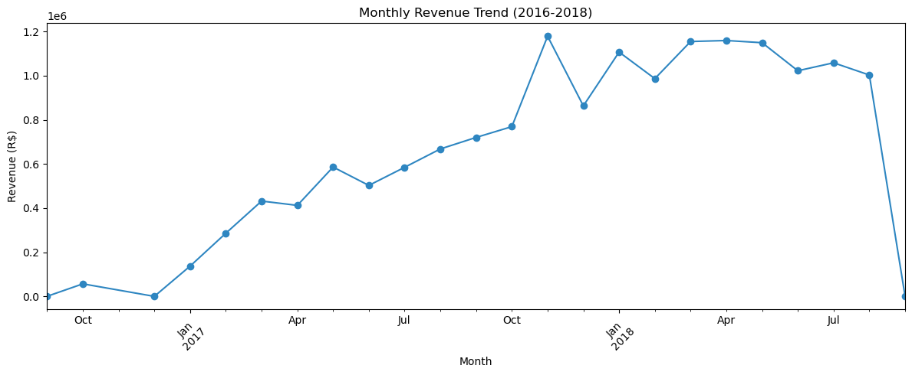
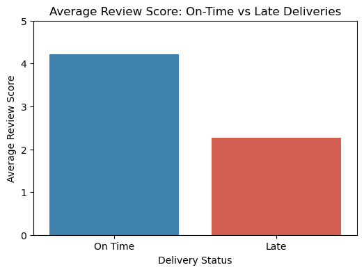
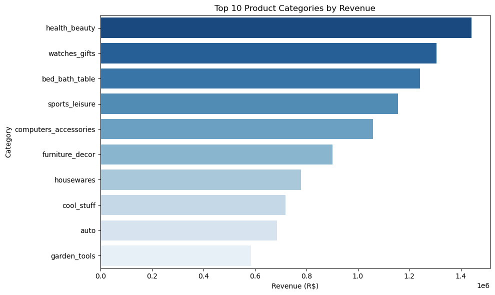
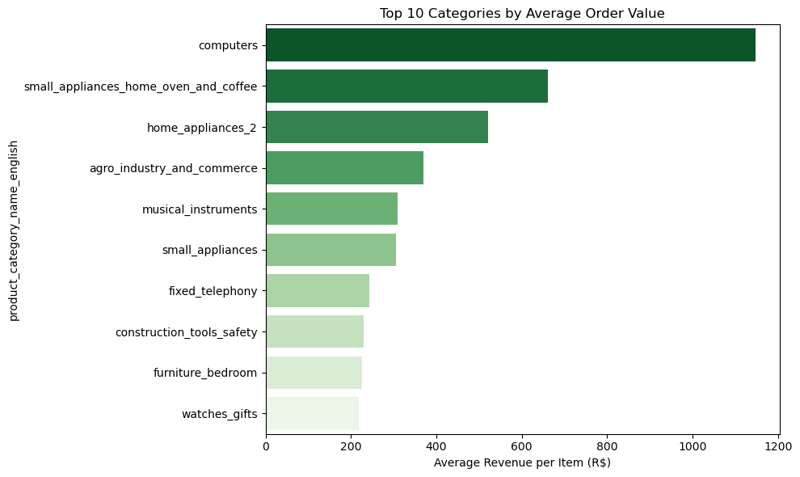

# 🛒 Olist E-Commerce Performance Analysis

**Author:** Tomiwa Richard  
**Dataset:** [Olist Brazilian E-Commerce — Kaggle](https://www.kaggle.com/datasets/olistbr/brazilian-ecommerce)  
**Period Covered:** 2016 — 2018  
**Total Orders Analysed:** 99,441  

---

## Project Type Blueprint

* ✅ Python (Data Cleaning, Wrangling & EDA)
* ✅ Spreadsheet Analytics (Excel Dashboard)
* ✅ Business Intelligence (Power BI Dashboard)
* ✅ Business Case Study & Recommendations
* ☐ Predictive Modeling / Machine Learning

---

## Table of Contents

1. [Project Overview](#project-overview)
2. [Business Problem](#business-problem)
3. [Project Objectives](#project-objectives)
4. [Dataset Overview](#dataset-overview)
5. [Tools & Technologies](#tools--technologies)
6. [Data Workflow](#data-workflow)
7. [Data Cleaning](#data-cleaning)
8. [Feature Engineering](#feature-engineering)
9. [Analysis & Key Findings](#analysis--key-findings)
10. [Excel Dashboard](#excel-dashboard)
11. [Power BI Dashboard](#power-bi-dashboard)
12. [Key Findings Summary](#key-findings-summary)
13. [Recommendations](#recommendations)
14. [Repository Structure](#repository-structure)

---

## Project Overview

The Olist dataset contains transactional, customer, product, payment, seller, and logistics information from a large Brazilian e-commerce marketplace.

The objective of this project is to transform raw transactional data into actionable business insights that can improve operational efficiency, customer experience, and revenue performance.

---

## Business Problem

E-commerce businesses rely heavily on customer satisfaction, logistics efficiency, and product performance to drive sustainable growth.

However, identifying revenue drivers, customer pain points, and operational inefficiencies becomes increasingly difficult as transaction volume grows.

This project seeks to answer critical business questions surrounding:

* Revenue performance
* Product category performance
* Delivery efficiency
* Customer satisfaction
* Geographic sales distribution
* Customer retention

---

## Project Objectives

The analysis aims to:

* Analyse revenue trends over time
* Evaluate delivery performance and delays
* Identify top-performing product categories
* Understand customer satisfaction drivers
* Map geographic revenue concentration
* Assess customer retention patterns

---

## Dataset Overview

The dataset consists of 9 separate CSV files sourced from Kaggle that were joined together for analysis:

| File | Description | Rows |
|---|---|---|
| olist_orders_dataset | Order status and delivery dates | 99,441 |
| olist_order_items_dataset | Products, prices, and freight per order | 112,650 |
| olist_order_reviews_dataset | Customer review scores and comments | 99,224 |
| olist_order_payments_dataset | Payment types and values | 103,886 |
| olist_customers_dataset | Customer location data | 99,441 |
| olist_products_dataset | Product dimensions and categories | 32,951 |
| olist_sellers_dataset | Seller location data | 3,095 |
| olist_geolocation_dataset | Zip code coordinates | 1,000,163 |
| product_category_name_translation | Portuguese to English category names | 71 |

The relevant files were merged and cleaned into a single working dataset before analysis.

---

## Tools & Technologies

| Tool | Purpose |
|---|---|
| Python (Pandas, Matplotlib, Seaborn) | Data cleaning, feature engineering, EDA |
| Excel | Pivot table analysis and interactive dashboard |
| Power BI | Multi-page business intelligence dashboard |
| Jupyter Notebook | Analysis documentation and presentation |
| GitHub | Version control and portfolio hosting |

---

## Data Workflow

```
Raw Data (9 CSV files)
        ↓
Data Exploration & Inspection
        ↓
Data Cleaning & Merging
        ↓
Feature Engineering
        ↓
Exploratory Data Analysis
        ↓
Excel Dashboard
        ↓
Power BI Dashboard
        ↓
Business Recommendations
```

---

## Data Cleaning

Several cleaning steps were applied to improve data quality before analysis:

| Issue Found | Action Taken |
|---|---|
| Date columns stored as text | Converted all date columns to datetime format |
| Missing delivery dates (2,965 orders) | Filtered to delivered orders only for delivery analysis |
| Missing product categories (610 products) | Labelled as unknown |
| Review comment nulls | Excluded — review score used instead |
| No duplicates found | No action needed |

**Data Cleaning Summary:**

| Metric | Count |
|---|---|
| Total Orders | 99,441 |
| Missing Order Dates Handled | 2,965 |
| Missing Product Categories Handled | 610 |
| Duplicates Removed | 0 |
| New Features Created | 6 |

---

## Feature Engineering

New columns were created from existing data to enable deeper analysis:

| Feature | Description |
|---|---|
| `delivery_time` | Actual days taken from purchase to delivery |
| `estimated_delivery_time` | Days originally estimated at time of order |
| `delivery_delay` | Difference between actual and estimated delivery |
| `is_late` | Flag — True if delivery arrived after estimated date |
| `revenue` | Price + freight value per order item |
| `order_month` | Month extracted from purchase timestamp |

---

## Analysis & Key Findings

### Revenue Trend

Monthly revenue was analysed across the full 2016—2018 period.



**Findings:**
- Strong consistent growth from late 2016 through 2018
- A clear spike in **November 2017** — driven by Black Friday
- A sharp drop in September 2018 — confirmed as an **incomplete data cutoff**, not an actual sales decline

---

### Delivery Performance

- **93.4%** of orders were delivered on time
- Orders arrived an average of **12 days earlier** than the estimated delivery date
- Olist sets conservative estimates which naturally improves customer perception of delivery speed
- Only **6.6%** of orders were delivered late — but the impact on satisfaction was severe

---

### Customer Satisfaction vs Delivery Status



**Findings:**
- On-time deliveries average a review score of **4.21 / 5**
- Late deliveries average only **2.27 / 5**
- A late delivery nearly **halves** customer satisfaction
- Although only 6.6% of orders are late, this small group has a disproportionately large negative impact on overall platform ratings

---

### Product Category Performance — Total Revenue



**Findings:**
- **Health & Beauty** leads total revenue at R$1.44M
- **Watches & Gifts** and **Bed, Bath & Table** follow closely
- The top 10 categories account for the majority of all platform revenue

---

### Product Category Performance — Average Order Value



**Findings:**
- **Computers** has the highest average order value at **R$1,286** per item
- Despite this, Computers does not appear in the top 10 by total revenue — it is a **low volume, high value** category
- This contrasts with Health & Beauty which drives volume but has a lower average order value
- These two categories require completely different marketing strategies

---

### Geographic Revenue Distribution

Revenue is heavily concentrated in Brazil's southeast region:

| State | Revenue | Share of Total |
|---|---|---|
| São Paulo (SP) | R$5.92M | 37.4% |
| Rio de Janeiro (RJ) | R$2.13M | 13.4% |
| Minas Gerais (MG) | R$1.86M | 11.7% |
| **Top 3 Combined** | **R$9.91M** | **62.5%** |

This level of geographic concentration is a business risk — over-reliance on one region leaves the platform vulnerable to regional economic or logistical disruptions.

---

### Customer Retention

- **96.7% of customers made only a single purchase**
- Repeat buying behaviour is extremely rare on the platform
- Olist is operating almost entirely on new customer acquisition
- Shifting even a small percentage of one-time buyers into repeat customers represents a significant untapped revenue opportunity

---

## Excel Dashboard

An Excel pivot table analysis and interactive dashboard was built to summarise key metrics visually across revenue, products, and geography.


---

## Power BI Dashboard

A multi-page interactive Power BI dashboard was created covering:

* **Executive Overview** — Total revenue, orders, average order value, top state
* **Products** — Revenue by category, average order value by category
* **Delivery & Logistics** — On-time rate, delivery times by state, slowest delivery states
* **Customer & Review** — Review score distribution, on-time vs late comparison
* **Insights & Recommendations** — Key business takeaways

📄 [View Power BI Dashboard PDF](reports/Powerbi%20e-commerce%20analysis%20pdf.pdf)

---

## Key Findings Summary

| Area | Finding |
|---|---|
| Total Revenue | R$15.84M across 99,441 orders — strong growth 2016 to 2018 |
| Delivery Performance | 93.4% on time — orders arrive 12 days earlier than estimated |
| Customer Satisfaction | Late deliveries drop score from 4.21 to 2.27 — nearly halved |
| Top Revenue Category | Health & Beauty — R$1.44M total revenue |
| Highest Average Order Value | Computers — R$1,286 per order |
| Geographic Concentration | São Paulo alone = 37% of revenue; top 3 states = 62.5% |
| Customer Retention | 96.7% of customers bought only once |

---

## Recommendations

**1. Prioritise At-Risk Shipments**
Late deliveries severely damage satisfaction scores. An early warning system to flag and escalate orders at risk of delay would protect customer experience and platform ratings significantly.

**2. Apply a Dual Category Strategy**
Stop treating all product categories the same. Apply high-frequency volume marketing for Health & Beauty to maintain transaction volume. Apply premium positioning, financing options, and targeted campaigns for high-AOV categories like Computers.

**3. Invest in Customer Retention**
With 96.7% of customers buying only once, even a small improvement in repeat purchase rate would generate significant revenue without the cost of new customer acquisition. Post-purchase engagement flows, loyalty programmes, and personalised recommendations are worth building immediately.

**4. Geographic Expansion**
Reduce dependency on the southeast by actively growing merchant and fulfilment networks in underserved regions. Establishing logistics infrastructure in emerging states would lower delivery times nationally and diversify the revenue base away from its current concentration risk.

---

## Case Study

A full stakeholder-facing case study summarising all findings and recommendations in plain business English:

📄 [Olist E-Commerce Case Study PDF](reports/Olist_Ecommerce_Analysis_Case_Study.pdf)

---

## Repository Structure

```
olist-ecommerce-analysis/
│
├── notebooks/
│   └── Olist E-Commerce python analysis.ipynb
│
├── reports/
│   ├── Olist_Ecommerce_Analysis_Case_Study.pdf
│   └── Powerbi e-commerce analysis pdf.pdf
│
├── images/
│   ├── monthly_revenue_trend.png
│   ├── top10_categories_revenue.png
│   ├── top10_categories_aov.png
│   ├── review_score_ontime_vs_late.png
│   └── Excel E-commerce analysis dashboard.png
│
└── README.md
```

---

*Dataset source: [Olist Brazilian E-Commerce Dataset on Kaggle](https://www.kaggle.com/datasets/olistbr/brazilian-ecommerce)*  
*Author: Tomiwa Richard*
