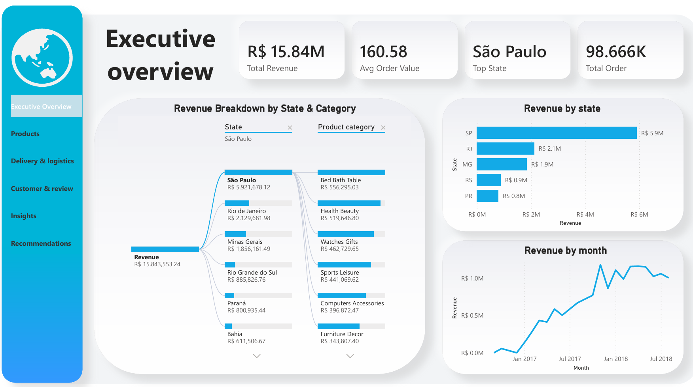

# Olist E-Commerce Performance Analysis

**One-Sentence Summary:** An end-to-end e-commerce analytics project leveraging Python, Excel, and Power BI to analyze over 100,000 Brazilian e-commerce transactions, identify operational bottlenecks, evaluate customer satisfaction drivers, and uncover revenue growth opportunities.

---

## Project Type Blueprint

* ☑ Python (Data Cleaning, Wrangling & EDA)
* ☑ Spreadsheet Analytics (Excel Dashboard)
* ☑ Business Intelligence (Power BI Dashboard)
* ☑ Business Case Study & Recommendations
* ☐ Predictive Modeling / Machine Learning

---

# Table of Contents

## Table of Contents

1. [Project Overview](#project-overview)
2. [Business Problem](#business-problem)
3. [Project Objectives](#project-objectives)
4. [Dataset Overview](#dataset-overview)
5. [Tools & Technologies](#tools--technologies)
6. [Data Workflow](#data-workflow)
7. [Data Model & Schema Summary](#data-model--schema-summary)
8. [Analysis & Key Metrics](#analysis--key-metrics)
9. [Key Findings & Insights](#key-findings--insights)
10. [Business Recommendations](#business-recommendations)
11. [Dashboard Preview](#dashboard-preview)
12. [Project Deliverables](#project-deliverables)
13. [Assumptions & Limitations](#assumptions--limitations)
14. [Future Enhancements](#future-enhancements)

---

# Project Overview

The Olist dataset contains transactional, customer, product, payment, seller, and logistics information from a large Brazilian e-commerce marketplace.

The objective of this project is to transform raw transactional data into actionable business insights that can improve operational efficiency, customer experience, and revenue performance.

---

# Business Problem

E-commerce businesses rely heavily on customer satisfaction, logistics efficiency, and product performance to drive sustainable growth.

However, identifying revenue drivers, customer pain points, and operational inefficiencies becomes increasingly difficult as transaction volume grows.

This project seeks to answer critical business questions surrounding:

* Revenue performance
* Product category performance
* Delivery efficiency
* Customer satisfaction
* Geographic sales distribution
* Customer retention

---

# Project Objectives

The analysis aims to:

* Analyze revenue trends over time
* Evaluate delivery performance and delays
* Identify top-performing product categories
* Understand customer satisfaction drivers
* Examine customer retention behavior
* Discover geographic sales opportunities
* Generate actionable business recommendations

---

# Dataset Overview

**Source:** Kaggle – Olist Brazilian E-Commerce Dataset

The project integrates multiple relational datasets including:

* Customers
* Orders
* Order Items
* Products
* Sellers
* Payments
* Reviews
* Geolocation Data

After cleaning and transformation, these datasets were merged into a unified analytical model.

---

# Tools & Technologies

### Data Analysis

* Python
* Pandas
* NumPy

### Data Visualization

* Matplotlib
* Seaborn

### Dashboard Development

* Microsoft Excel
* Power BI

### Version Control

* Git
* GitHub

---

# Data Workflow

### 1. Data Collection

Imported and explored multiple Olist datasets.

### 2. Data Cleaning

* Missing value treatment
* Data type conversion
* Data validation
* Quality checks

### 3. Data Integration

Merged relational datasets into a consolidated analytical dataset.

### 4. Feature Engineering

Created business metrics including:

* Delivery Time
* Delivery Delay
* Estimated Delivery Duration
* Customer Retention Indicators

### 5. Exploratory Data Analysis

Analyzed:

* Revenue trends
* Product performance
* Customer behavior
* Logistics performance
* Customer satisfaction

### 6. Dashboard Development

Built interactive dashboards in Excel and Power BI.

---

# Data Model & Schema Summary

The analytical dataset combines customer, order, payment, review, and product information into a unified structure for business analysis.

**Main Entities**

* Customers
* Orders
* Products
* Payments
* Reviews
* Sellers

---

# Analysis & Key Metrics

### Revenue Metrics

* Total Revenue
* Average Order Value
* Monthly Revenue Growth

### Logistics Metrics

* Average Delivery Time
* Delivery Delay Rate
* On-Time Delivery Rate

### Customer Metrics

* Customer Satisfaction Score
* Repeat Purchase Rate
* Customer Retention Rate

### Product Metrics

* Revenue by Category
* Average Order Value by Category

---

# Key Findings & Insights

## Revenue Performance

* Revenue increased steadily between 2016 and 2018.
* Black Friday generated a significant sales spike.

## Delivery Performance

* Approximately 93.4% of orders were delivered on time.
* Average delivery duration was approximately 12 days.

## Customer Satisfaction

* Delayed deliveries significantly reduced review scores.
* On-time deliveries consistently achieved higher customer ratings.

## Product Performance

* Health & Beauty generated the highest overall revenue.
* Computer-related products achieved the highest average order value.

## Geographic Performance

* São Paulo contributed the largest share of total revenue.
* Revenue was concentrated in a small number of states.

## Customer Retention

* Most customers purchased only once.
* Customer retention represents a major growth opportunity.

---

# Business Recommendations

### Improve Customer Retention

Develop loyalty programs and personalized marketing campaigns to increase repeat purchases.

### Reduce Delivery Delays

Optimize logistics operations and delivery tracking processes.

### Strengthen Top Product Categories

Invest additional marketing resources into consistently high-performing categories.

### Expand Geographic Reach

Explore growth opportunities in underperforming states while maintaining focus on key revenue-generating regions.

### Prepare for Peak Demand

Increase inventory and operational readiness before major promotional events such as Black Friday.

---

# Dashboard Preview

## Power BI Dashboard

# Project Deliverables

* Python Analysis Notebook
* Excel Dashboard
* Power BI Dashboard
* Business Case Study Report
* GitHub Documentation

---

# Assumptions & Limitations

* Analysis is based on historical transaction data.
* Customer lifetime value was not calculated.
* External economic factors were not included.
* Results depend on the completeness and quality of the original dataset.

---

# Future Enhancements

Potential future improvements include:

* Customer Segmentation Analysis
* Customer Lifetime Value Modeling
* Sales Forecasting
* Predictive Analytics
* Recommendation Systems
* Churn Prediction Models

